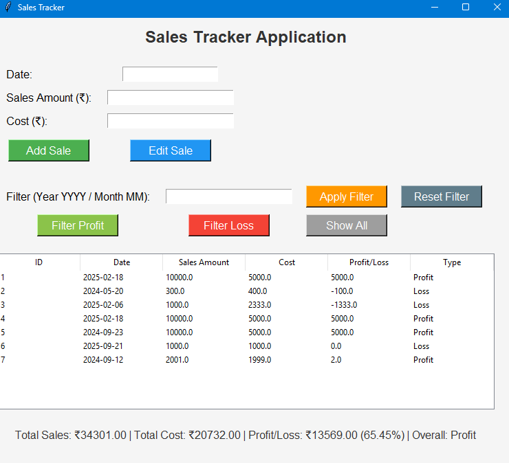

# 🧾 Sales Tracker Application

A simple desktop-based Sales Tracker built with **Python**, **Tkinter**, **SQLite**, and **TkCalendar**. This application helps users manage and analyze sales, cost, and profit/loss data through an intuitive graphical interface.

---

## ✨ Features

- 📆 Select and save sales data with date, sales amount, and cost.
- 📈 Automatically calculate profit or loss per entry.
- 📊 View all records in a sortable TreeView table.
- 🧮 Display overall totals, profit percentage, and status (Profit / Loss / Break-Even).
- 🔍 Filter records by:
  - **Year (YYYY)**
  - **Month (MM)**
  - **Profit**, **Loss**, or show **All**
- ✏️ Edit existing entries with a single click.
- ✅ Clean and minimalistic user interface.

---

## 🖼️ Screenshot



---

## 🖥️ Tech Stack

- **Python 3**
- **Tkinter** – for GUI
- **SQLite3** – for database
- **tkcalendar** – for date selection widget

---

## 🚀 How to Run the Application

```bash
python sales_tracker.py
```

---

## 🗃️ Database Structure

This app uses a local SQLite database named `sales_tracker.db`.

**Table:** `sales`

| Column         | Type    | Description              |
|----------------|---------|--------------------------|
| `id`           | INTEGER | Primary Key              |
| `date`         | TEXT    | Date of the sale         |
| `sales_amount` | REAL    | Sales amount (₹)         |
| `cost`         | REAL    | Cost of goods sold (₹)   |
| `profit_loss`  | REAL    | Auto-calculated (₹)      |

---

## 🔧 Project Structure

```
sales-tracker/
│
├── sales_tracker.py         # Main application script
├── sales_tracker.db         # Created automatically on first run
├── salestracer.png          # App screenshot
└── README.md                # Project documentation
```

---

## 🚀 Future Enhancements

- Export records to Excel or CSV  
- Graphs for monthly/yearly analysis  
- Multi-user login system  
- Dark mode / Light mode toggle  
- Cloud-based data sync  

---

## 🤝 Contributing

Pull requests are welcome!  
For major changes, please open an issue to discuss your ideas first.

---

## 📄 License

This project is licensed under the [MIT License](https://opensource.org/licenses/MIT).

---

## 🙌 Acknowledgments

- Python Community  
- Modules: `tkinter`, `sqlite3`, `tkcalendar`
